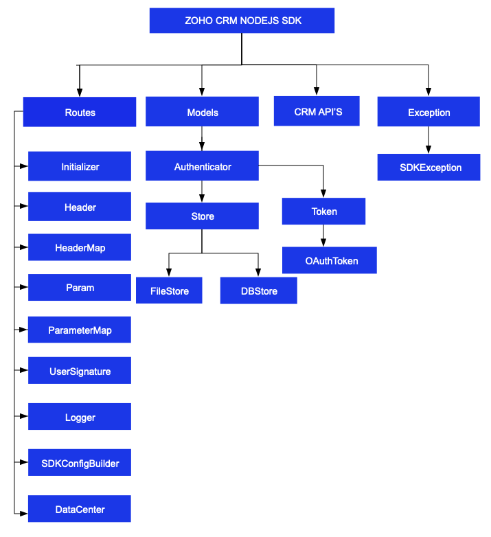

# License

    Copyright (c) 2021, ZOHO CORPORATION PRIVATE LIMITED
    All rights reserved.

    Licensed under the Apache License, Version 2.0 (the "License");
    you may not use this file except in compliance with the License.
    You may obtain a copy of the License at

        http://www.apache.org/licenses/LICENSE-2.0

    Unless required by applicable law or agreed to in writing, software
    distributed under the License is distributed on an "AS IS" BASIS,
    WITHOUT WARRANTIES OR CONDITIONS OF ANY KIND, either express or implied.
    See the License for the specific language governing permissions and
    limitations under the License.

# ZOHO CRM NODEJS SDK 6.0 for API version 6

## Table Of Contents

- [Overview](#overview)
- [Registering a Zoho Client](#registering-a-zoho-client)
- [Environmental Setup](#environmental-setup)
- [Including the SDK in your project](#including-the-sdk-in-your-project)
- [Persistence](#token-persistence)
  - [DataBase Persistence](#database-persistence)
  - [File Persistence](#file-persistence)
  - [Custom Persistence](#custom-persistence)
- [Configuration](#configuration)
- [Initialization](#initializing-the-application)
- [Class Hierarchy](#class-hierarchy)
- [Responses And Exceptions](#responses-and-exceptions)
- [Multi User Support](#multi-user-support-in-the-nodejs-sdk)
- [Sample Code](#sdk-sample-code)

## Overview

Zoho CRM NodeJS SDK offers a way to create client NodeJS applications that can be integrated with Zoho CRM.

## Registering a Zoho Client

Since Zoho CRM APIs are authenticated with OAuth2 standards, you should register your client app with Zoho. To register your app:

- Visit this page [https://api-console.zoho.com/](https://api-console.zoho.com)

- Click `ADD CLIENT`.

- Choose the `Client Type`.

- Enter **Client Name**, **Client Domain** or **Homepage URL** and **Authorized Redirect URIs** then click `CREATE`.

- Your Client app will be created.

- Select the created OAuth client.

- Generate grant token by providing the necessary scopes, time duration (the duration for which the generated token is valid) and Scope Description.

## Environmental Setup

NodeJS SDK is installable through **npm**. **npm** is a tool for dependency management in NodeJS. SDK expects the following from the client app.

- Client app must have Node(version 14.21.3 and above)

- NodeJS SDK must be installed into client app through **npm**.

## Including the SDK in your project

You can include the SDK to your project using:

- Install **Node** from [nodejs.org](https://nodejs.org/en/download/) (if not installed).

- Install **NodeJS SDK**

  - Navigate to the workspace of your client app.
  - Run the command below:

  ```sh
  npm install @zohocrm/nodejs-sdk-6.0
  ```

- The NodeJS SDK will be installed and a package named **@zohocrm/nodejs-sdk-6.0** will be created in the local machine.

- include the field - "type" = "module"; in your package.json file to make use of ES modules.

- Another method to install the SDK
  - Add dependencies to the package.json of the node server with the latest version (recommended)
  - Run **npm install** in the directory which installs all the dependencies mentioned in package.json.

## Token Persistence

Token persistence refers to storing and utilizing the authentication tokens that are provided by Zoho. Token persistence enables the SDK to automatically refresh the access token after initialization using the refresh token without the need for user intervention. There are three ways provided by the SDK in which persistence can be utilized. They are File Persistence, DataBase Persistence, and Custom Persistence.Please note that the default method of token persistence provided by the Zoho CRM SDK is File persistence

### Table of Contents

- [DataBase Persistence](#database-persistence)

- [File Persistence](#file-persistence)

- [Custom Persistence](#custom-persistence)

### Implementing OAuth Persistence

Once the application is authorized, OAuth access and refresh tokens can be used for subsequent user data requests to Zoho CRM. Hence, they need to be persisted by the client app.

The persistence is achieved by writing an implementation of the inbuilt **TokenStore class**, which has the following callback methods.

- **findToken(token)** - invoked before firing a request to fetch the saved tokens. This method should return implementation **Token Class** object for the library to process it.

- **saveToken(token)** - invoked after fetching access and refresh tokens from Zoho.

- **deleteToken(id)** - invoked before saving the latest tokens.

- **getTokens()** - The method to retrieve all the stored tokens.

- **deleteTokens()** - The method to delete all the stored tokens.

- **findTokenById(id)** - This method is used to retrieve the user token details based on unique ID.

Note:

- id is a string.

- token is an instance of **Token** class.

### DataBase Persistence

Database persistence is a technique that involves storing and retrieving data from a database. In case the user prefers to use default DataBase persistence, **MySQL** can be used.

- Create a table in your Database with required columns

  - id varchar(10)

  - user_name varchar(255)

  - client_id varchar(255)

  - client_secret varchar(255)

  - refresh_token varchar(255)

  - access_token varchar(255)

  - grant_token varchar(255)

  - expiry_time varchar(20)

  - redirect_url varchar(255)

  - api_domain varchar(255)

Note:

- Custom database name and table name can be set in DBStore instance

#### MySQL Query

```sql
CREATE TABLE oauthtoken (
  id varchar(10) NOT NULL,
  user_name varchar(255),
  client_id varchar(255),
  client_secret varchar(255),
  refresh_token varchar(255),
  access_token varchar(255),
  grant_token varchar(255),
  expiry_time varchar(20),
  redirect_url varchar(255),
  api_domain varchar(255),
  primary key (id)
);
```

#### Create DBStore object

```js
import * as ZOHOCRMSDK from "@zohocrm/nodejs-sdk-6.0"
/*
 * DBStore takes the following parameters
 * host -> DataBase host name. Default value "localhost"
 * databaseName -> DataBase name. Default  value "zohooauth"
 * userName -> DataBase user name. Default value "root"
 * password -> DataBase password. Default value ""
 * portNumber -> DataBase port number. Default value "3306"
 * tableName -> Table Name. Default value "oauthtoken"
 */

let tokenstore = new ZOHOCRMSDK.DBBuilder()
  .host("hostName")
  .databaseName("databaseName")
  .userName("userName")
  .portNumber("portNumber")
  .tableName("tableName")
  .password("password")
  .build();
```

### File Persistence

In case of default File Persistence, the user can persist tokens in the local drive, by providing the the absolute file path to the FileStore object.

- The File contains

  - id

  - user_name

  - client_id

  - client_secret

  - refresh_token

  - access_token

  - grant_token

  - expiry_time

  - redirect_url

  - api_domain

#### Create FileStore object

```js
import * as ZOHOCRMSDK from "@zohocrm/nodejs-sdk-6.0";
/*
 * FileStore takes the following parameter
 * 1 -> Absolute file path of the file to persist tokens
 */
let tokenstore = new ZOHOCRMSDK.FileStore(
  "/Users/username/Documents/nodejs_sdk_tokens.txt"
);
```

### Custom Persistence

Users can create their own logic for storing and retrieving authentication tokens using the custom persistence technique.To use Custom Persistence, the user must extend **[TokenStore Class](models/authenticator/store/token_store.js)** and override the methods.

```js
import * as ZOHOCRMSDK from "@zohocrm/nodejs-sdk-6.0";

class CustomStore extends ZOHOCRMSDK.TokenStore {
  constructor() {
    super();
  }

  /**
   *
   * @param {Token} token A Token (@zohocrm/nodejs-sdk-6.0/models/authenticator/oauth_token) class instance.
   * @returns A Token class instance representing the user token details.
   * @throws {SDKException} if any error occurs.
   */
  findToken(token) {
    // Add code to get the token
    return null;
  }

  /**
   *
   * @param {Token} token A Token (@zohocrm/nodejs-sdk-6.0/models/authenticator/oauth_token) class instance.
   * @throws {SDKException} if any error occurs.
   */
  saveToken(token) {
    // Add code to save the token
  }

  /**
   *
   * @param {String} id A String representing Token ID.
   * @throws {SDKException} if any error occurs.
   */
  deleteToken(id) {
    // Add code to delete the token
  }

  /**
   * @returns {Array} - An array of Token class instances
   * @throws {SDKException}
   */
  getTokens() {
    //Add code to retrieve all the stored tokens.
  }

  /**
   * @throws {SDKException}
   */
  deleteTokens() {
    //Add code to delete all the stored tokens.
  }

  /**
   * @param {String} id A string.
   * @return {Token} A Token class instance representing the user token details.
   * @throws {SDKException} if any problem occurs.
   */
  findTokenById(id) {
    // Add code to get the token using unique id
    return null;
  }
}

export { CustomStore as CustomStore };
```

## Configuration

Before you get started with creating your NodeJS application, you need to register your client and authenticate the app with Zoho.

| Mandatory Keys | Optional Keys |
| :------------- | :------------ |
|  environment   | logger        |
|  token         | store         |
|                | SDKConfig     |
|                | requestProxy  |
|                | resourcePath  |

---
The **environment** key contains the domain information to make API calls. The **token** key represents the OAuth info, including the clientID, clientSecret, grantToken, redirectURL, refreshToken or accessToken depending on the flow that you use. Refer to ##create an instance of OAuthToken## for more details.

- Configure API environment which decides the domain and the URL to make API calls.

  ```js
  import * as ZOHOCRMSDK from "@zohocrm/nodejs-sdk-6.0";
  /*
   * Configure the environment
   * which is of the pattern Domain.Environment
   * Available Domains: USDataCenter, EUDataCenter, INDataCenter, CNDataCenter, AUDataCenter,CADataCenter
   * Available Environments: PRODUCTION(), DEVELOPER(), SANDBOX()
   */
  let environment = ZOHOCRMSDK.USDataCenter.PRODUCTION();
  ```

- Create an instance of **[OAuthToken](models/authenticator/oauth_token.js)** with the information that you get after registering your Zoho client.In the context of token persistence, the grant token flow and refresh token flow involve storing and persisting the token. However, the access token flow does not involve token persistence and the access token is directly utilized for API calls. Depending on the tokens available with you, choose grantToken flow, refreshToken flow or accessToken flow.

  - By default, the findUser key is set to true, to set userSignature. However, this requires the ***ZohoCRM.users.READ*** and ***ZohoCRM.org.READ*** scopes to be mandatory. If you do not want to set userSignature, you must set the findUser key to false.

  - Use the following method for **grantToken flow:**
  ```js
   let token = (new ZOHOCRMSDK.OAuthBuilder())
    .clientId("clientId")
    .clientSecret("clientSecret")
    .grantToken("grantToken")
    .redirectURL("redirectURL")
    .findUser(false)// by default true
    .build();
  ```
  - Use the following method for **refreshToken flow:**
  ```js
  let token = (new ZOHOCRMSDK.OAuthBuilder())
    .clientId("clientId")
    .clientSecret("clientSecret")
    .refreshToken("refreshToken")
    .redirectURL("redirectURL")
    .findUser(false)// by default true
    .build();
  ```
  - Use the following method for **accessToken flow:**
  ```js
  let token = (new ZOHOCRMSDK.OAuthBuilder())
    .accessToken("accessToken")
    .findUser(false)// by default true
    .build();
  ```
  - Use the following method for **Id flow :**
  ```js
  let token = (new ZOHOCRMSDK.OAuthBuilder())
    .id("id")
    .build();
  ```

- Create an instance of **Logger** Class to log exception and API information. By default, the SDK constructs a Logger instance with level - INFO and file_path - (sdk_logs.log parallel to node_modules)

  ```js
  import * as ZOHOCRMSDK from "@zohocrm/nodejs-sdk-6.0";
  /*
   * Create an instance of Logger Class that requires the following
   * level -> Level of the log messages to be logged. Can be configured by typing Levels "." and choose any level from the list displayed.
   * filePath -> Absolute file path, where messages need to be logged.
   */
  let logger = new ZOHOCRMSDK.LogBuilder()
    .level(ZOHOCRMSDK.Levels.INFO)
    .filePath("/Users/Documents/final-logs.txt")
    .build();
  ```

- Create an instance of **TokenStore** to persist tokens, used for authenticating all the requests. By default, the SDK creates the sdk_tokens.txt file (parallel to node_modules folder) to persist the tokens.

  - Use the following method for DBStore
  ```js
  /*
   * Create an instance of DBStore that requires the following
   * host -> DataBase host name. Default value "localhost"
   * databaseName -> DataBase name. Default  value "zohooauth"
   * userName -> DataBase user name. Default value "root"
   * password -> DataBase password. Default value ""
   * portNumber -> DataBase port number. Default value "3306"
   * tabletName -> DataBase table name. Default value "oauthtoken"
   */

  let tokenstore = new ZOHOCRMSDK.DBBuilder()
    .host("hostName")
    .databaseName("databaseName")
    .userName("userName")
    .portNumber("portNumber")
    .tableName("tableName")
    .password("password")
    .build();
  ```
  - Use the following method for FileStore
  ```js
  let tokenstore = new ZOHOCRMSDK.FileStore("absolute_file_path");
  ```
  - Use the following method for Custom Store
  ```js
  let tokenstore = new CustomStore();
  ```

- Create an instance of **SDKConfig** containing the SDK configuration.

  ```js
  import * as ZOHOCRMSDK from "@zohocrm/nodejs-sdk-6.0";

  /*
   * By default, the SDK creates the SDKConfig instance
   * autoRefreshFields (default value is false)
   * if true - all the modules' fields will be auto-refreshed in the background, every hour.
   * if false - the fields will not be auto-refreshed in the background. The user can manually delete the file(s) or refresh the fields using methods from ModuleFieldsHandler(utils/util/module_fields_handler.js)
   *
   * pickListValidation
   * A boolean field that validates user input for a pick list field and allows or disallows the addition of a new value to the list.
   * if true - the SDK validates the input. If the value does not exist in the pick list, the SDK throws an error.
   * if false - the SDK does not validate the input and makes the API request with the user’s input to the pick list
   */
  let sdkConfig = new ZOHOCRMSDK.SDKConfigBuilder()
    .pickListValidation(false)
    .autoRefreshFields(true)
    .build();
  ```

- Create an instance of **[RequestProxy](routes/request_proxy.js)** containing the proxy properties of the user.

  ```js
  import * as ZOHOCRMSDK from "@zohocrm/nodejs-sdk-6.0";

  /*
   * RequestProxy class takes the following parameters
   * host -> Host
   * port -> Port Number
   * user -> User Name. Default null.
   * password -> Password. Default null
   */
  let requestProxy = new ZOHOCRMSDK.ProxyBuilder()
    .host("proxyHost")
    .port("proxyPort")
    .user("proxyUser")
    .password("password")
    .build();
  ```

- The path containing the absolute directory path to store user specific files containing module fields information. By default, the SDK stores the user-specific files in a folder parallel to node_modules

  ```js
  let resourcePath = "/Users/nodejs-app";
  ```

## Initializing the Application

Initialize the SDK using the following code.

```js
import * as ZOHOCRMSDK from "@zohocrm/nodejs-sdk-6.0";

class Initializer {
  static async initialize() {
    let logger = new ZOHOCRMSDK.LogBuilder()
      .level(ZOHOCRMSDK.Levels.INFO)
      .filePath("/Users/user_name/Documents/nodejs_sdk_log.log")
      .build();
    let environment = ZOHOCRMSDK.USDataCenter.PRODUCTION();
    let token = new ZOHOCRMSDK.OAuthBuilder()
      .clientId("clientId")
      .clientSecret("clientSecret")
      .grantToken("GRANT Token")
      .redirectURL("redirectURL")
      .build();
    let tokenstore = new ZOHOCRMSDK.DBBuilder()
      .host("hostName")
      .databaseName("databaseName")
      .userName("userName")
      .portNumber("portNumber")
      .tableName("tableName")
      .password("password")
      .build();
    let sdkConfig = new ZOHOCRMSDK.SDKConfigBuilder()
      .pickListValidation(false)
      .autoRefreshFields(true)
      .build();
    let resourcePath = "/Users/nodejssdk-application";
    let requestProxy = new ZOHOCRMSDK.ProxyBuilder()
      .host("proxyHost")
      .port("proxyPort")
      .user("proxyUser")
      .password("password")
      .build();
    (await new ZOHOCRMSDK.InitializeBuilder())
      .environment(environment)
      .token(token)
      .store(tokenstore)
      .SDKConfig(sdkConfig)
      .resourcePath(resourcePath)
      .logger(logger)
      .requestProxy(requestProxy)
      .initialize()
      .catch((err) => {
        console.log(err);
      });
  }
}
```
- You can now access the functionalities of the SDK. Refer to the sample codes to make various API calls through the SDK.

## Class Hierarchy



## Responses and Exceptions

All SDK method calls return an instance of **[APIResponse](routes/controllers/api_response.js)**.

After a successful API request, the **getObject()** method returns an instance of the ResponseWrapper (for **GET**) or the ActionWrapper (for **POST, PUT, DELETE**).

Whenever the API returns an error response, the **getObject()** returns an instance of **APIException** class.

**ResponseWrapper** (for **GET** requests) and ActionWrapper (for **POST, PUT, DELETE** requests) are the expected objects for Zoho CRM APIs’ responses

However, some specific operations have different expected objects, such as the following

- Operations involving records in Tags

  - **RecordActionWrapper**

- Getting Record Count for a specific Tag operation

  - **CountWrapper**

- Operations involving BaseCurrency

  - **BaseCurrencyActionWrapper**

- Lead convert operation

  - **ConvertActionWrapper**

- Retrieving Deleted records operation

  - **DeletedRecordsWrapper**

- Record image download operation

  - **FileBodyWrapper**

- MassUpdate record operations

  - **MassUpdateActionWrapper**
  - **MassUpdateResponseWrapper**

- For Transfer Pipeline operation
  - **APIResponse&lt;TransferPipelineActionHandler&gt;**

All other exceptions such as SDK anomalies and other unexpected behaviours are thrown under the **[SDKException](core/com/zoho/crm/api/exception/sdk_exception.js)** class.

### GET Requests

- The **getObject()** of the returned APIResponse instance returns the response as follows.

- Most of the APIs follows the **Common** Structure as below.

  - The **ResponseHandler class** encompasses the following
    - **ResponseWrapper class** (for **application/json** responses)
    - **FileBodyWrapper class** (for File download responses)
    - **APIException class**

- Some of the APIs follow the **Particular** Structure as below.

  - The **ResponseHandler interface** encompasses the following
    - **HistoryWrapper class** (for **application/json** responses in **backup** API, holds the list of instances of **History class** and instance of **Info class**)
    - **UrlsWrapper class** (for **application/json** responses in **backup** API, holds the instance of **Urls class**)
    - **SourcesCountWrapper class** (for **application/json** responses in **UserGroups** API, holds the List of instances of **SourceCount class**)
    - **SourcesWrapper class** (for **application/json** responses in **Usergroups** APi, holds the List of instances of **Sources class** and instance of **Info class**)


  - The **ResponseWrapper interface** in **BulkWrite** API encompasses the following
    - **BulkWriteResponse class** (for **application/json** responses)
    - **APIException class**

  - The **CountHandler interface** encompasses the following
    - **CountWrapper class** (for **application/json** responses in **Record** API, holds the Long **count**)
    - **APIException class**

  - The **DeletedRecordsHandler interface** encompasses the following
    - **DeletedRecordsWrapper class** (for **application/json** responses in **Record** API, holds the list of instances of **DeletedRecord class** and instance of **Info class**)
    - **APIException class**

  - The **DownloadHandler interface** encompasses the following
    - **FileBodyWrapper class** (for File download responses)
    - **APIException class**

  - The **MassUpdateResponseHandler interface** encompasses the following
    - **MassUpdateResponseWrapper class** (for **application/json** responses in **Record** API, holds the list of instances of **MassUpdateResponse interface**)
    - **APIException class**

  - The **MassUpdateResponse interface** encompasses of following
    - **MassUpdate class** (for **application/json** responses)
    - **APIException class**

  - The **ValidationHandler interface** in **UserTerritories** API encomposses the following
    - **ValidationWrapper class** (for **application/json** responses, holds the list of instances of **ValidationGroup interface**)
    - **APIException class**

  - The **ValidationGroup interface** in **UserTerritories** API encompasses the following
    - **Validation class**
    - **BulkValidation class**

### POST, PUT, DELETE Requests

- The **getObject()** of the returned APIResponse instance returns the response as follows.

- Most of the APIs follows the **Common** Structure as.

  - The **ActionHandler class** encompasses the following
    - **ActionWrapper class** (for **application/json** responses)
    - **APIException class**

  - The **ActionWrapper class** contains **Property/Properties** that may contain one/list of **ActionResponse class**.

  - The **ActionResponse class** encompasses the following
    - **SuccessResponse class** (for **application/json** responses)
    - **APIException class**


- Some of the APIs follow the **Particular** Structure as.

  - The **ActionHandler interface** encompasses the following
    - **ActionWrapper class** (for **application/json** responses)
    - **APIException class**

  - The **ActionWrapper class** contains **Property/Properties** that may contain one/list of **ActionResponse interface**.

  - The **RecordActionHandler interface** encompasses the following
    - **RecordActionWrapper class** (for **application/json** responses in **Tags** API, holds the list of instance of **RecordActionResponse interface**, Boolean **wfScheduler**, String **successCount** and Boolean **lockedCount**)
    - **APIException class**

  - **RecordActionResponse interface** encompasses the following
    - **RecordSuccessResponse class** (for **application/json** responses)
    - **APIException class**

  - The **ActionHandler interface** in **Currencies** API encompasses the following
    - **BaseCurrencyActionWrapper class** (for **application/json** responses)
    - **APIException class**

  - The **BaseCurrencyActionWrapper class** contains **Property/Properties** that contain **BaseCurrencyActionResponse interface**.

  - The **BaseCurrencyActionResponse interface** encompasses the following
    - **SuccessResponse class** (for **application/json** responses)
    - **APIException class**

  - The **MassUpdateActionHandler interface** encompasses the following
    - **MassUpdateActionWrapper class** (for **application/json** responses in **Record** API, holds the list of instances of **MassUpdateActionResponse interface**)
    - **APIException class**

  - The **MassUpdateActionResponse interface** encompasses of following
    - **MassUpdateSuccessResponse class** (for **application/json** responses)
    - **APIException class**

  - The **FileHandler interface** in **Record** API encompasses the following
    - **SuccessResponse class** (for **application/json** responses)
    - **APIException class**

  - The **SignActionHandler interface** in **MailMerge** API encompasses the following
    - **SignActionWrapper class** (for **application/json** responses)
    - **APIException class**
    
  - The **DeleteActionHandler interface** encompasses the following
    - **DeleteActionWrapper class** (for **application/json** responses in **ShareRecords** API, holds the instance of **DeleteActionResponse interface**)
    - **APIException class**
    
  - The **DeleteActionResponse interface** encompasses the following
    - **SuccessResponse class** (for **application/json** responses)
    - **APIException class**

  - The **TransferActionHandler interface** in **UserTerritories** API encompasses the following
    - **TransferActionWrapper class** (fro **application/json** responses , holds the list of instances of **TransferActionResponse interface**)

  - The **TransferActionResponse interface** encompasses the following
    - **SuccessResponse class** (for **application/json** responses)
    - **APIException class**

  - The **ActionResponse interface** in **Territories** API encompasses the following
    - **Success class** (for **application/json** responses)
    - **APIException class**

  - The **TransferPipelineActionHandler interface** in **Pipeline** API encompasses the following
    - **TransferPipelineActionWrapper class** (for **application/json** responses, holds the list of insatnces of **TransferPipelineActionResponse interface**)
    - **APIException class**

  - The **TransferPipelineActionResponse interface** in **Pipeline** API encompasses the following
    - **TransferPipelineSuccessResponse class** (for **application/json** responses)
    - **APIException class**

## Multi-user App

In the NodeJS SDK, multi-user functionality is achieved using the **switchUser()**method.

Please note that only one user can send requests at a time. If another user need to send requests, the **switchUser()** method must be used prior to sending the requests.
```js
//If proxy needs to be configured for the User
(await new ZOHOCRMSDK.InitializeBuilder())
  .environment(environment)
  .token(token)
  .SDKConfig(sdkConfig)
  .switchUser()
  .catch((err) => {
    console.log(err);
  });
```

To Remove a user's configuration in SDK. Use the below code

```js
await ZOHOCRMSDK.Initializer.removeUserConfiguration(token).catch((err) => {
  console.log(err);
});
```

### Sample Multi-user code

```js
import * as ZOHOCRMSDK from "@zohocrm/nodejs-sdk-6.0";
class Record {
  static async call() {
    let environment1 = ZOHOCRMSDK.USDataCenter.PRODUCTION();
    let token1 = new ZOHOCRMSDK.OAuthBuilder()
      .clientId("clientId")
      .clientSecret("clientSecret")
      .refreshToken("refreshToken")
      .redirectURL("redirectURL")
      .build();
    (await new ZOHOCRMSDK.InitializeBuilder())
      .environment(environment1)
      .token(token1)
      .initialize()
      .catch((err) => {
        console.log(err);
      });
    await Record.getRecords("Leads").catch((err) => {
      console.log(err);
    });
    await ZOHOCRMSDK.Initializer.removeUserConfiguration(token).catch(
      (err) => {
        console.log(err);
      }
    );
    let environment2 = ZOHOCRMSDK.EUDataCenter.SANDBOX();
    let token2 = new ZOHOCRMSDK.OAuthBuilder()
      .clientId("clientId")
      .clientSecret("clientSecret")
      .refreshToken("REFRESH Token")
      .redirectURL("redirectURL")
      .build();
    (await new ZOHOCRMSDK.InitializeBuilder())
      .environment(environment2)
      .token(token2)
      .switchUser()
      .catch((err) => {
        console.log(err);
      });
    await Record.getRecords("Leads").catch((err) => {
      console.log(err);
    });
  }
  static async getRecords(moduleAPIName) {
    try {
      let recordOperations = new ZOHOCRMSDK.Records.RecordOperations(moduleAPIName);
      let paramInstance = new ZOHOCRMSDK.ParameterMap();
      await paramInstance.add(ZOHOCRMSDK.Records.GetRecordsParam.APPROVED, "both");
      let fieldNames = ["Company", "Email"];
      await paramInstance.add(ZOHOCRMSDK.Record.GetRecordsParam.FIELDS, fieldNames.toString());
      let headerInstance = new ZOHOCRMSDK.HeaderMap();
      await headerInstance.add(
        ZOHOCRMSDK.Records.GetRecordsHeader.IF_MODIFIED_SINCE,
        new Date("2020-01-01T00:00:00+05:30")
      );
      let response = await recordOperations.getRecords(
        paramInstance,
        headerInstance
      );
      if (response != null) {
        console.log("Status Code: " + response.getStatusCode());
        if ([204, 304].includes(response.getStatusCode())) {
          console.log(
            response.getStatusCode() == 204 ? "No Content" : "Not Modified"
          );
          return;
        }
        let responseObject = response.getObject();
        if (responseObject != null) {
          if (responseObject instanceof ZOHOCRMSDK.Records.ResponseWrapper) {
            let records = responseObject.getData();
            for (let index = 0; index < records.length; index++) {
              let record = records[index];
              console.log("Record ID: " + record.getId());
              let createdBy = record.getCreatedBy();
              if (createdBy != null) {
                console.log("Record Created By User-ID: " + createdBy.getId());
                console.log(
                  "Record Created By User-Name: " + createdBy.getName()
                );
                console.log(
                  "Record Created By User-Email: " + createdBy.getEmail()
                );
              }
              console.log("Record CreatedTime: " + record.getCreatedTime());
              let modifiedBy = record.getModifiedBy();
              if (modifiedBy != null) {
                console.log(
                  "Record Modified By User-ID: " + modifiedBy.getId()
                );
                console.log(
                  "Record Modified By User-Name: " + modifiedBy.getName()
                );
                console.log(
                  "Record Modified By User-Email: " + modifiedBy.getEmail()
                );
              }
              console.log("Record ModifiedTime: " + record.getModifiedTime());
              let tags = record.getTag();
              if (tags != null) {
                tags.forEach((tag) => {
                  console.log("Record Tag Name: " + tag.getName());
                  console.log("Record Tag ID: " + tag.getId());
                });
              }
              let keyValues = record.getKeyValues();
              let keyArray = Array.from(keyValues.keys());
              for (let keyIndex = 0; keyIndex < keyArray.length; keyIndex++) {
                const keyName = keyArray[keyIndex];
                let value = keyValues.get(keyName);
                console.log(keyName + " : " + value);
              }
            }
          }
        }
      }
    } catch (error) {
      console.log(error);
    }
  }
}

Record.call();
```

- The program execution starts from call().

- The details of **"user1"** are is given in the variables user1, token1, environment1.

- Similarly, the details of another user **"user2"** is given in the variables user2, token2, environment2.

- The **switchUser()** function is used to switch between the **"user1"** and **"user2"** as required.

- Based on the latest switched user, the **Record.getRecords(moduleAPIName)** will fetch records.

## SDK Sample code

```js
import * as ZOHOCRMSDK from "@zohocrm/nodejs-sdk-6.0";

class CreateRecords {
  static async initialize() {
    let environment = ZOHOCRMSDK.USDataCenter.PRODUCTION();
    let token = (new ZOHOCRMSDK.OAuthBuilder())
            .clientId("1000.xxxx")
            .clientSecret("xxxxxx")
            .refreshToken("1000.xxxxx.xxxxx")
            .build();
    (await new ZOHOCRMSDK.InitializeBuilder())
            .environment(environment)
            .token(token)
            .initialize();
  }
  static async createRecords(moduleAPIName) {
    //example
    //let moduleAPIName = "module_api_name";
    let recordOperations = new ZOHOCRMSDK.Records.RecordOperations(moduleAPIName);
    let request = new ZOHOCRMSDK.Records.BodyWrapper();
    let recordsArray = [];
    let record = new ZOHOCRMSDK.Records.Record();
    record.addFieldValue(ZOHOCRMSDK.Records.Field.Leads.LAST_NAME, "Node JS SDK");
    record.addFieldValue(ZOHOCRMSDK.Records.Field.Leads.FIRST_NAME, "Node");
    recordsArray.push(record);
    request.setData(recordsArray);
    let headerInstance = new ZOHOCRMSDK.HeaderMap();
    let response = await recordOperations.createRecords(request, headerInstance);
    if (response != null) {
      console.log("Status Code: " + response.getStatusCode());
      let responseObject = response.getObject();
      if (responseObject != null) {
        if (responseObject instanceof ZOHOCRMSDK.Records.ActionWrapper) {
          let actionResponses = responseObject.getData();
          actionResponses.forEach(actionResponse => {
            if (actionResponse instanceof ZOHOCRMSDK.Records.SuccessResponse) {
              console.log("Status: " + actionResponse.getStatus().getValue());
              console.log("Code: " + actionResponse.getCode().getValue());
              console.log("Details");
              let details = actionResponse.getDetails();
              if (details != null) {
                Array.from(details.keys()).forEach(key => {
                  console.log(key + ": " + details.get(key));
                });
              }
              console.log("Message: " + actionResponse.getMessage().getValue());
            } else if (actionResponse instanceof ZOHOCRMSDK.Records.APIException) {
              console.log("Status: " + actionResponse.getStatus().getValue());
              console.log("Code: " + actionResponse.getCode().getValue());
              console.log("Details");
              let details = actionResponse.getDetails();
              if (details != null) {
                Array.from(details.keys()).forEach(key => {
                  console.log(key + ": " + details.get(key));
                });
              }
              console.log("Message: " + actionResponse.getMessage().getValue());
            }
          });
        }
      }
    }
  }
}
await CreateRecords.initialize();
let moduleAPIName = "leads";
await CreateRecords.createRecords(moduleAPIName);
```
